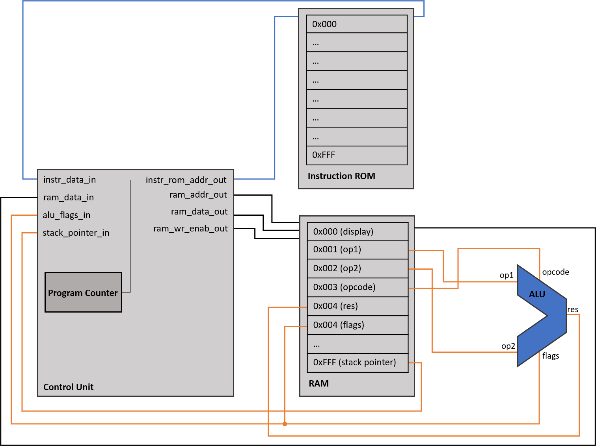
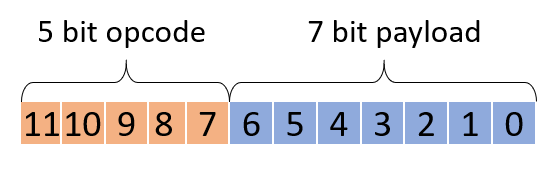

# SimpleCPU documentation

## Overview
<figure>
  
  <figcaption>Block diagram</figcaption>
</figure>
 
 

## ISA
<figure>
  
  <figcaption>Instruction format</figcaption>
</figure>
 
 

| opcode (hex) | Mnemonic  | Explanation                                                                                       |
|--------|-----------|---------------------------------------------------------------------------------------------------|
| 0      | NOP       | No Operation                                                                                      |
| 1      | RS-Vf     | Save 7 bit value to RAM at follow-up address                                                      |
| 2      | RS-Af     | Save the 12 bit follow-up value to 7 bit RAM address                                              |
| 3      | RS-ff     | Save 12 bit follow-up value to 12-bit follow-up address                                           |
| 4      | RS-Vif    | Save 7 bit value to RAM at follow-up pointer address                                              |
| 5      | RS-iAf    | Save the 12 bit follow-up value to 7 bit pointer address                                          |
| 6      | RS-iff    | Save the 12 bit follow-up value to 12 bit follow-up pointer address                               |
| 7      | RC-Af     | Copy value from 7 bit address1 to follow up address2                                              |
| 8      | RC-fA     | Copy value from follow-up address1 to 7 bit address2                                              |
| 9      | RC-ff     | Copy value from follow-up address to follow-up address                                            |
| A      | RC-iAif   | Copy value from 7 bit pointer to follow up pointer                                                |
| B      | RC-ifiA   | Copy value from follow-up pinter to 7 bit pointer                                                 |
| C      | RC-ifif   | Copy value from follow-up pointer to follow-up pointer                                            |
| D      | JP        | Direct Jump. Set instruction counter to 7 bit value                                               |
| E      | JP-f      | Direct Jump. Set instruction counter to 12 bit follow-up value                                    |
| F      | JR        | Relative jump. Add  7 bit value to instruction counter                                            |
| 10     | JPE       | Direct Jump. If OP1 = OP2, set instruction counter to 7 bit value                                 |
| 11     | JPE-f     | Direct Jump. If OP1 = OP2, set instruction counter to 12 bit follow-up value                      |
| 12     | JRE       | Relative jump. If OP1 = OP2, add  7 bit value to instruction counter                              |
| 13     | JPO       | Direct Jump. If ALU overflow, set instruction counter to 7 bit value                              |
| 14     | JPO-f     | Direct Jump. If ALU overflow, set instruction counter to 12 bit value                             |
| 15     | JRO       | Relative jump. If ALU overflow, add  7 bit value to instruction counter                           |
| 16     | UNDEFINED | N/A                                                                                               |
| 17     | UNDEFINED | N/A                                                                                               |
| 18     | UNDEFINED | N/A                                                                                               |
| 19     | UNDEFINED | N/A                                                                                               |
| 1A     | UNDEFINED | N/A                                                                                               |
| 1B     | SSR       | Start subroutine at 7 bit address                                                                 |
| 1C     | SSR-f     | Start subroutine at 12 bit follow-up address                                                      |
| 1D     | SSRR      | Start subroutine at relative 7 bit address (subroutine address = current address + 7 bit address) |
| 1E     | ESR       | escape subroutine                                                                                |
| 1F     | HALT      | Stops the program                                                                                 |

## Functional description
